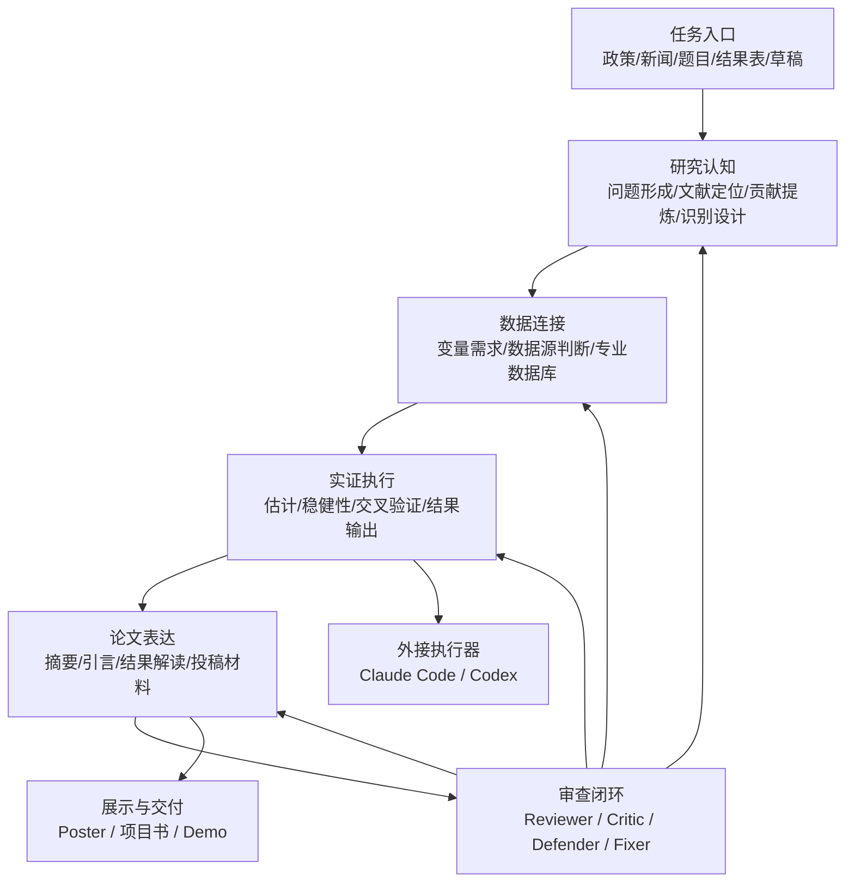
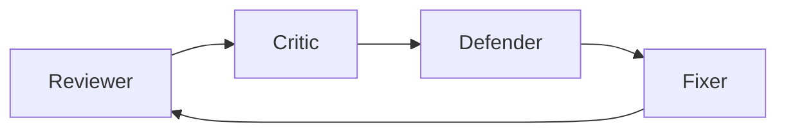
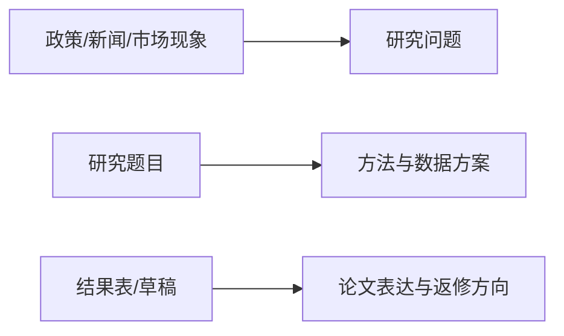
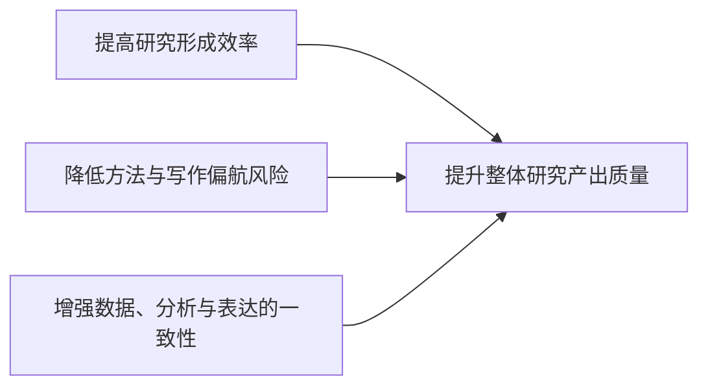

# 经研龙虾（Econ Claw）

> 面向经济学与金融学研究场景的闭环式 AI 学术工作台

## 项目概述

**经研龙虾（Econ Claw）** 是一个面向经济学、金融学与经管实证研究场景的垂直 AI 学术工作台。

它的目标，不是把 AI 停留在“帮研究者写几段话”的层面，而是把 AI 推进到真实研究生产链中：从研究问题形成、文献定位、识别设计、数据连接、实证分析，到论文表达、投稿前质检与返修准备，形成一套可持续调用、可审查、可回流修正的闭环工作流。

在当前大模型应用中，通用型 AI 已经显著提升了文本生成效率，但在经济金融研究里，真正制约产出的往往不是写作速度，而是：

- 研究问题是否真正成立
- 贡献定位是否清楚
- 方法路径是否可信
- 数据方案是否可行
- 结果解释是否越界
- 论文是否经得起审稿追问

经研龙虾正是围绕这些真实痛点构建的。

---

## 项目背景与核心问题

经济金融研究有三个非常明显的特点：

### 1. 研究链条长，且环环相扣
从现实问题到学术问题，从学术问题到识别设计，从识别设计到数据方案，再从分析结果走向论文表达，每一层都依赖上一层的质量。

### 2. 对“严谨性”的要求极高
与很多通用内容生产场景不同，经济金融研究中的一个小失配，都可能导致整篇研究站不住：
- 变量定义偏了，结论会偏
- 方法路径错了，识别就不成立
- 解释越界了，审稿就会直接打回来

### 3. 通用 AI 容易产生“伪严谨”
最危险的情况不是内容太少，而是内容看起来很完整，却在关键节点存在严重漏洞，例如：
- 文献编造或误引
- 把相关性写成因果
- 用专业术语掩盖设计漏洞
- 在结果不稳时过度拔高贡献

因此，这个场景真正需要的不是一个更会写的模型，而是一套**更懂研究流程、更懂方法边界、更懂审稿逻辑**的系统。

---

## 项目定位

经研龙虾的定位可以概括为一句话：

> **一个面向经济金融研究的闭环式 AI 学术工作台。**

它不是：
- 通用论文润色器
- 单轮问答型学术聊天机器人
- 只会给方法解释的知识助手

它更接近于：
- 一个研究任务编排器
- 一个经济金融研究流程操作台
- 一个内置审查机制的学术协作系统

---

## 核心方案

经研龙虾采用“**任务入口 + 研究引擎 + 审查闭环 + 外接执行**”的整体结构。



这套结构的关键，不只是把流程串起来，而是让系统同时具备两种能力：

1. **向前推进研究**：从问题走到分析，从分析走到论文与交付。  
2. **向后回看研究**：在关键节点做批评、审查、修补与收缩，避免错误一路放大。

---

## 能力结构

经研龙虾当前的能力结构，不是几个写作功能和几个方法模块的简单拼装，而是一套围绕“**把一个模糊研究想法推进成可研究、可执行、可交付成果**”而构建的完整系统。

### 第一层：研究前端 —— 把问题想清楚
解决的是“研究什么、为什么值得研究”。

包括：
- 从政策、新闻、市场现象中提炼问题
- 把现实问题转成学术问题
- 梳理已有研究做到哪一步
- 提炼真正新增的价值
- 比较不同方法路径的适配性

### 第二层：研究中台 —— 把分析做实
解决的是“怎么把研究真正跑起来”。

包括：
- 识别变量需求与数据来源
- 对接 CSMAR 等专业数据库
- 组织数据清洗、描述统计与估计流程
- 调用 DID / IV / RDD / Panel / SDID / Bootstrap / Placebo / Logit/Probit / LASSO 等方法能力
- 安排稳健性、交叉验证和结果输出

### 第三层：研究后端 —— 把成果做成可交付
解决的是“怎么把结果变成能交出去、经得起质疑的研究成果”。

包括：
- 摘要、引言、结果解读与结论表达
- 审稿人视角的批评与压力测试
- 对高风险表述进行收缩与修正
- 形成投稿材料、返修方向与 response letter 思路
- 将分析记录、草稿与修订意见沉淀为可复用研究资产


---

## 关键组件

### 1. 上层任务型能力
经研龙虾面向用户的直接入口主要包括：

- Topic Scout：选题雷达
- Literature Reviewer：文献与贡献定位
- Design Doctor：识别设计医生
- Empirics Workbench：实证工坊
- Paper Drafter：写作与投稿工坊
- Reviewer Mode：审稿人模式
- CSMAR Data：专业数据助手
- Journal Router：期刊路由器

### 2. 底层方法型能力
这部分是经研龙虾真正的研究引擎层，包括：

- run-did
- run-iv
- run-rdd
- run-panel
- run-sdid
- run-bootstrap
- run-placebo
- run-logit-probit
- run-lasso
- cross-check
- robustness
- make-table

### 3. 审查与修订角色
为了避免系统一路生成、一路放大错误，经研龙虾内置了完整审查闭环：

- **Reviewer**：从审稿人视角判断研究是否站得住
- **Critic**：集中攻击最脆弱的识别、解释与边界问题
- **Defender**：区分哪些批评成立，哪些结论需要收缩
- **Fixer**：将批评转成可执行的返修动作与后续分析任务



### 4. 外接执行与展示层
经研龙虾不仅可以作为内部研究工作台，也可以作为更高层的研究管理与交互中枢，向外连接：

- Claude Code
- Codex
- HTML Poster / PPT 生成器
- Demo Video 工具链

这意味着：

> **龙虾负责研究逻辑、任务编排、质量审查与用户交互；外部执行器负责代码、脚本、页面与展示产物实现。**

---

## 核心特色

### 1. 垂直面向经济金融研究
不是通用 AI 助手，而是专门服务于经济学、金融学和经管实证研究场景。

### 2. 不只写作，而是研究工作流
把 AI 从“文本辅助”推进到“研究工作流辅助”，覆盖问题形成、分析执行与成果交付三个层面。

### 3. 学术规范被沉淀为系统能力
项目参考高质量经济金融研究的复现代码、分析流程和研究共同体规范，把识别假设、稳健性要求、结果边界和写作约束沉淀为可调用能力。

### 4. 审查、校验与返修被嵌入主流程
Reviewer / Critic / Defender / Fixer 不是附加插件，而是主流程的一部分。

### 5. 兼容更强的外部执行体系
可套在 Claude Code、Codex 等执行器外层，形成“高层管理 + 外部实施”的双层工作流。

---

## 典型应用场景

### 场景一：政策 / 新闻 / 市场现象 → 研究问题
输入一个外部现实冲击，系统输出：
- 候选研究问题
- 核心变量方向
- 数据源建议
- 识别策略备选

### 场景二：研究题目 → 方法设计与数据方案
输入研究问题，系统输出：
- DID / IV / RDD / Panel 等方法比较
- 最小可行数据方案
- 稳健性与机制检验清单

### 场景三：结果表 / 草稿 → 论文表达与返修方向
输入结果表或初稿，系统输出：
- 论文表达建议
- 审稿人攻击点
- 返修路线和 response 思路



---

## 项目价值

经研龙虾的目标不是替代研究者，而是成为一个更懂经济金融研究流程的 AI 协作者，帮助研究者：

- 更快形成靠谱问题
- 更早发现设计漏洞
- 更系统组织数据与分析
- 更稳地完成论文写作与投稿前准备
- 更持续地沉淀研究资产与方法经验



---

## 公开链接

- **项目仓库**：<https://github.com/WiZENDUCK/econ-claw>
- **Poster 在线页**：<https://wizenduck.github.io/econ-claw/poster/econ-claw-poster-v1.html>
- **Poster 图片**：<https://wizenduck.github.io/econ-claw/poster/assets/econ-claw-poster-v1.png>
- **GitHub Pages 主页**：<https://wizenduck.github.io/econ-claw/>
- **项目书独立文件**：[`PROJECT_BRIEF.md`](./PROJECT_BRIEF.md)

---

## 仓库结构

```text
.
├── README.md
├── PROJECT_BRIEF.md
├── ROADMAP.md
├── SOUL.md
├── AGENTS.md
├── SKILLS.md
├── HEARTBEAT.md
├── docs/
│   ├── architecture.md
│   ├── demo-script.md
│   ├── external-execution.md
│   ├── use-cases.md
│   └── workflow-mapping.md
├── examples/
├── skills/
├── agents/
├── rules/
├── poster/
└── imported-skills/
```

---

## 当前阶段

当前仓库已经完成项目骨架、任务技能、方法技能、角色层、规则层和基础展示材料的第一轮搭建，接下来会优先推进：

1. 公开版说明页与项目展示页继续升级
2. 演示案例与 demo / video script
3. poster v2 与比赛展示物料升级
4. 更多研究技能和方法引擎补齐
5. 更完整的 MVP 演示闭环

---

## 愿景

经研龙虾希望回答一个很具体的问题：

> AI 能否不只帮研究者“写”，而是真正参与经济金融研究的完整生产链，并把研究从想法、数据、方法一路推进到可交付成果？

如果答案是肯定的，那么 AI 在学术领域的价值，就不再只是一个更快的写作工具，而是一套真正可以进入研究流程、承担协作职责的工作台系统。
